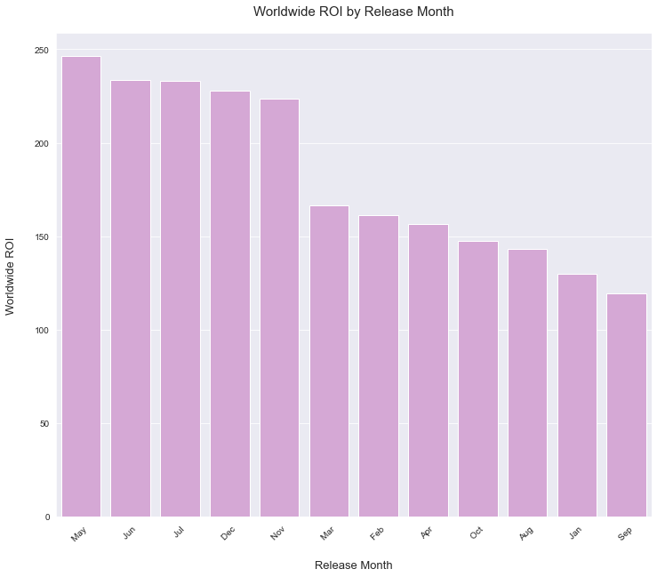
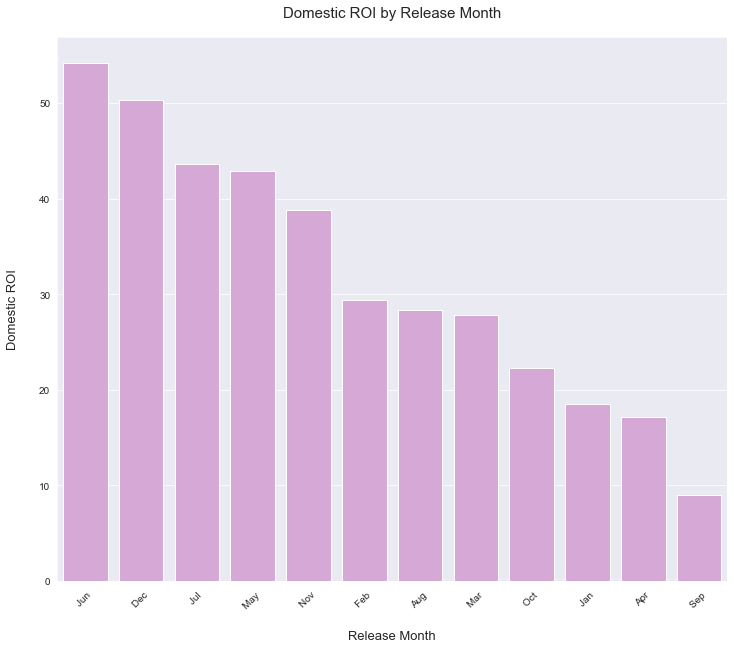
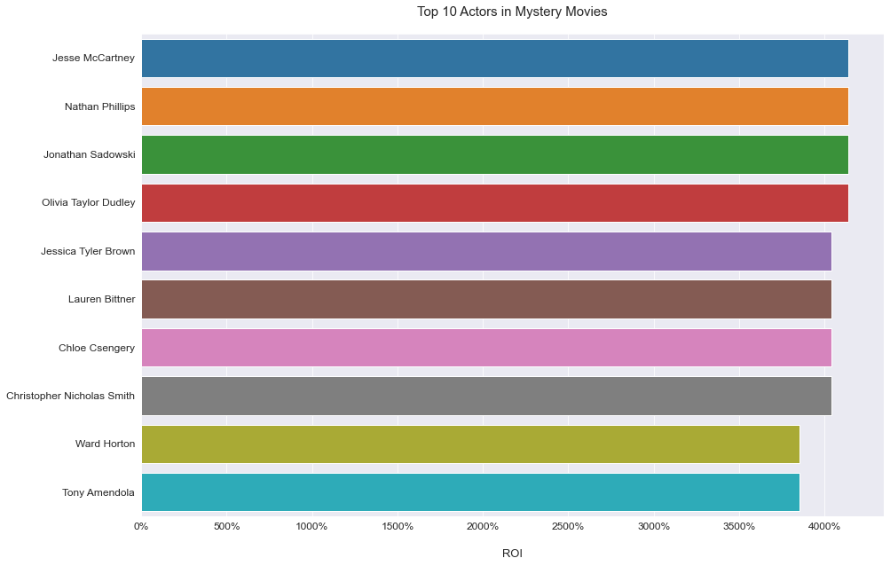
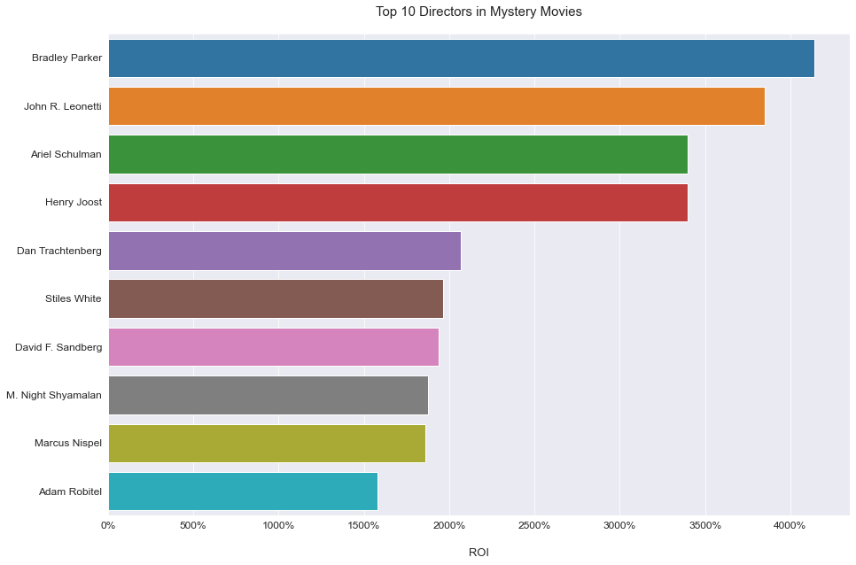
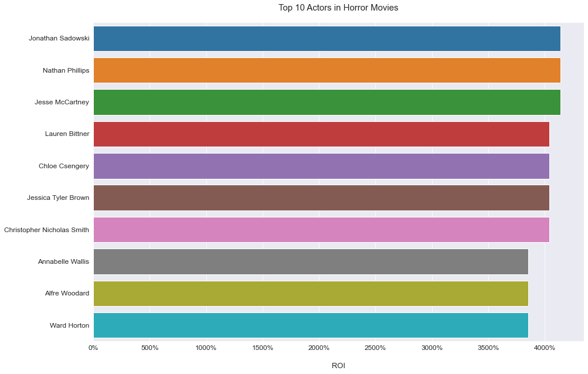
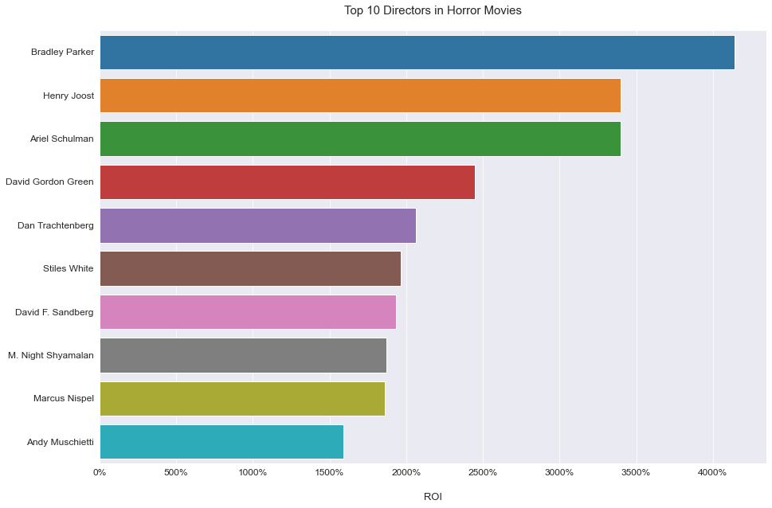
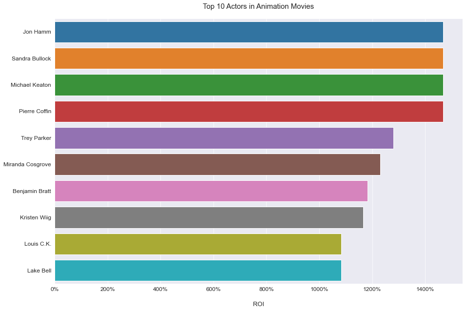
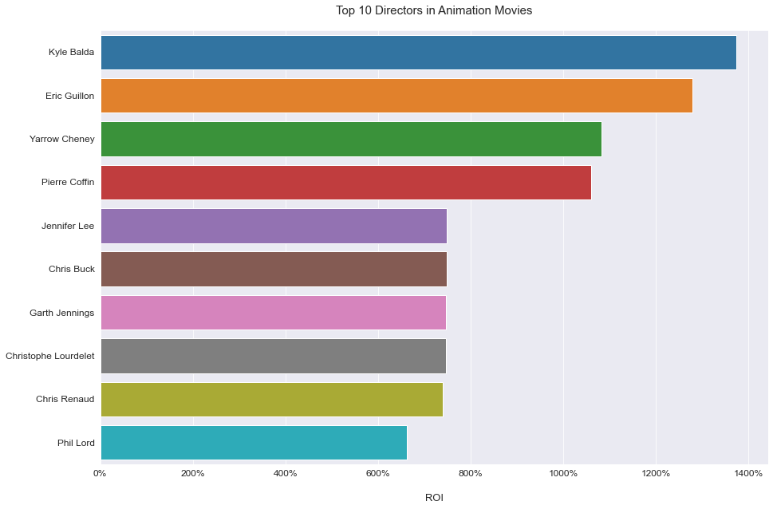

# Microsoft Movie Analysis
**Author**: Jennifer Ha
## Overview
This analysis project explores trends in film business to provide Microsoft with actionable recommendations as they want to enter this business as well. we will review data sets from TheNumbers.com and IMDb to determine when Microsoft should release a movie, which types of genres to consider, and whom to recruit. The methodology includes grouping, filtering, and joining and visualizing data sets to show different trends in ROI. The result shows higher ROI when Mystery, Horror, and Animation movies are released in May-July, and November-December. I recommend Microsoft to partner with lists of Top 10 actors and directors in those genres, and release movies during the summer (May-July) or holiday season (Nov-Dec).
***
## Business Problem
Microsoft sees all the big companies creating original video content and they want to get in on the fun. They have decided to create a new movie studio, but they don’t know anything about creating movies.
In order to assist the stakeholders at Microsoft to make data-driven decisions for their new business, we will be reviewing and analyzing datasets to provide a viable and profitable business option. The findings and recommendations will help the stakeholders with better understanding of the movie industry, to decide when to release their movies and who to work with to drive a successful outcome.
***
Questions to consider:
* When is the best time of year to release a movie?
* Which genres are the most profitable and yield the highest ROI?
* Who are the top casts and directors in those genres that Microsoft should work with?
***
## Data
For this project, the following data sets from The Numbers and IMDb were used to answer the questions in the above.
* `new_movie_budgets` & `tn_movie_budgets`: This data set from The Numbers contains movie production budget, domestic, and international revenue amount by movie, which will be used to conduct ROI analysis.
* `imdb_name_basics`: This data set from IMDb contains general movie information with movie title, runtime, and genre(s). Every movie has a unique ID (`tconst`) assigned, which will be used as the primary key to join other imdb data sets.
* `imdb_title_principals`: This data set from IMDb contains job titles for people who participated in a film with a unique ID (`nconst`) that can be used to identify individual participants. This data set also includes a foreign key (`tconst`).
* `imdb_title_basics`: This data set from IMDb contains names of individuals in the business with their profession title(s), movies they participated listed with the `tconst`, and their unique ID `nconst`.
***
## Methods
This project uses descriptive analysis, including description of ROI trends. This provides a useful overview of ROI by release month, genre, and individual (cast & directors).
***
## Results
### Release movies in May, June, July, November, or December!
Domestically and internationally, we see the highest ROI in May, June, July, November, December. Such trend tells us that people are more willing to go watch a movie during the summertime and holiday seasons towards the end of year.



### Mystery, Horror, Animation win!
I advise the stakeholders at Microsoft to consider producing movies in Mystery, Horror, Animation genres.

### Let's recruit people!
This analysis provides Microsoft with lists of actors and directors who were part of most successful movies in Mystery, Horror, and Animation. Microsoft should consider working with these individuals in order to enter the movie industry with "big hit" movies.






***
## Conclusions
This analysis leads to three recommendations for creating movies:

**1. Release movies in May, June, July, November, or December.** Our analysis shows that summertime and holiday seasons are the best time of year to release a movie. If Microsoft wants to release a movie across the world simultaneously, I recommend launching a movie in June or July. If a different timeline can be applied, release a movie in the States in May first, then internationally in June.

**2. Produce a movie in Mystery, Horror, Animation genres.** Microsoft has the capability to run movie business in many countries as it has many locations worldwide. Therefore, I recommend producing a movie in Mystery, Horror, and Animation to target audience globally.

**3. Recruit people with proven stats.** I provided lists of Top 10 actors and directors in Top 3 genres that generated the most profit. Microsoft should contact these individuals and try to recruit them to enter this competitive movie industry.
***
## Next Steps
Further analyses could lead to additional insights:
* **ROI Trend in Popular Genres**: while we have identified which top 3 genres have generated the most profit, such analysis can provide whether if the business is continuously growing in those genres over time.
* **Ideal Budget Range**: This modeling could predict the ideal production budget for the movies that Microsoft wants to produce.
***
## For More Information
See the full analysis in the [Jupyter Notebook](https://github.com/jennifernha/Microsoft-Movie-Analysis/blob/main/Microsoft%20Movie%20Analysis.ipynb) or review this [presentation](https://github.com/jennifernha/Microsoft-Movie-Analysis/blob/main/Presentation.pdf).
For additional info, contact Jennifer Ha at jnha1119@gmail.com
***
## Repository Structure
Describe the structure of your repository and its contents, for example:
```
├── images                        
├── Microsoft Movie Analysis.ipynb   
├── Prensentation.pdf                                    
└── README.md   
 